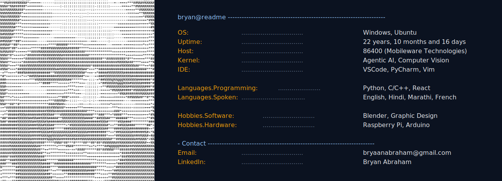

<pre>
  ___ ___         .__  .__           .___/\        __________                               
 /   |   \   ____ |  | |  |   ____   |   )/_____   \______   \_______ ___.__._____    ____  
/    ~    \_/ __ \|  | |  |  /  _ \  |   |/     \   |    |  _/\_  __ <   |  |\__  \  /    \ 
\    Y    /\  ___/|  |_|  |_(  <_> ) |   |  Y Y  \  |    |   \ |  | \/\___  | / __ \|   |  \
 \___|_  /  \___  >____/____/\____/  |___|__|_|  /  |______  / |__|   / ____|(____  /___|  /
       \/       \/                             \/          \/         \/          \/     \/ 
</pre>

## My GitHub

  

## My favorite tools and technologies ⚙️

<table>
  <!-- AI / ML / Data Science -->
  <tr>
    <td align="center" width="96"> Python</td>
    <td align="center" width="96"> C++</td>
    <td align="center" width="96"> C</td>
    <td align="center" width="96"> PyTorch</td>
    <td align="center" width="96"> TensorFlow</td>
    <td align="center" width="96"> Scikit-Learn</td>
    <td align="center" width="96"> OpenCV</td>
  </tr>

  <!-- Data Engineering / Big Data -->
  <tr>
    <td align="center" width="96"> Generative AI / LLMs</td>
    <td align="center" width="96"> NumPy</td>
    <td align="center" width="96"> Pandas</td>
    <td align="center" width="96"> Anaconda</td>
    <td align="center" width="96"> MySQL</td>
    <td align="center" width="96"> Redis</td>
    <td align="center" width="96"> Data Analysis (R)</td>
  </tr>

  <!-- Backend / Deployment / Cloud -->
  <tr>
    <td align="center" width="96"> Docker</td>
    <td align="center" width="96"> Kubernetes</td>
    <td align="center" width="96"> Terraform</td>
    <td align="center" width="96"> AWS</td>
    <td align="center" width="96"> GCP</td>
    <td align="center" width="96"> Azure</td>
    <td align="center" width="96"> FastAPI</td>
  </tr>

  <!-- General Development / OS -->
  <tr>
    <td align="center" width="96"> Git</td>
    <td align="center" width="96"> GitHub</td>
    <td align="center" width="96"> VS Code</td>
    <td align="center" width="96"> Bash</td>
    <td align="center" width="96"> Linux</td>
    <td align="center" width="96"> Pytest</td>
    <td align="center" width="96"> Raspberry Pi</td>
  </tr>

</table>

