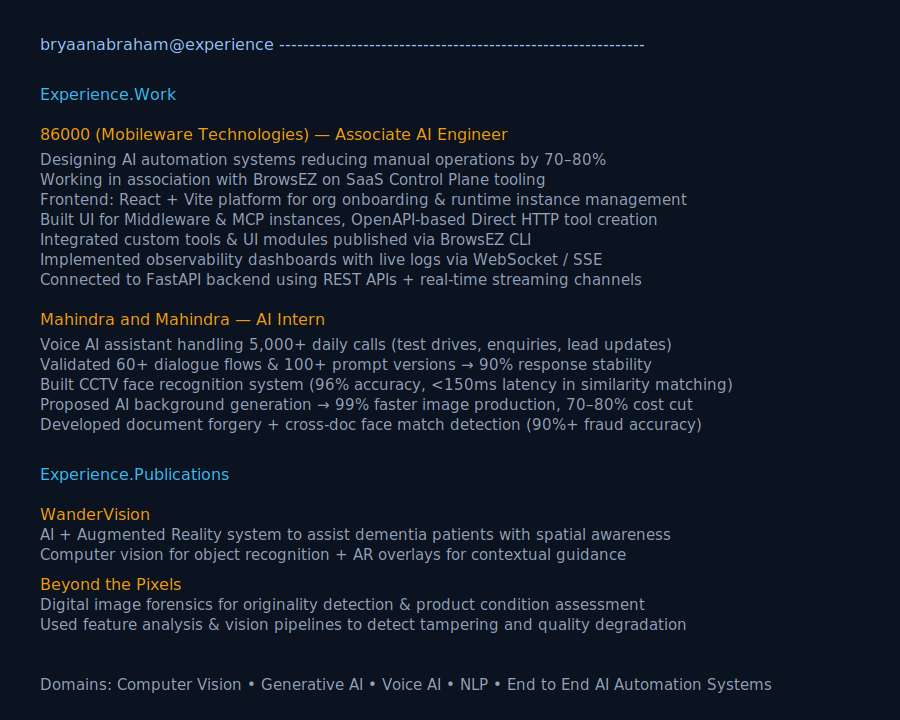
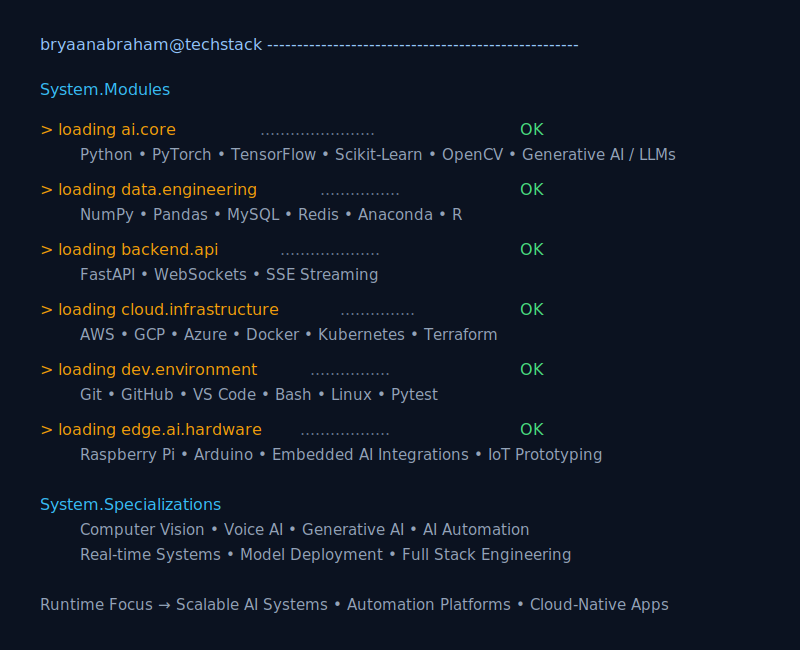
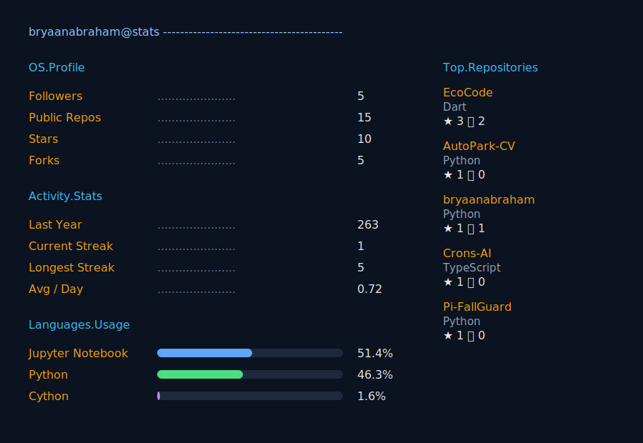

<pre>
  ___ ___         .__  .__              .___/\        __________                               
 /   |   \   ____ |  | |  |   ____      |   )/_____   \______   \_______ ___.__._____    ____  
/    ~    \_/ __ \|  | |  |  /  _ \     |   |/     \   |    |  _/\_  __ <   |  |\__  \  /    \ 
\    Y    /\  ___/|  |_|  |_(  <_> )    |   |  Y Y  \  |    |   \ |  | \/\___  | / __ \|   |  \
 \___|_  /  \___  >____/____/\____/ /\  |___|__|_|  /  |______  / |__|   / ____|(____  /___|  /
       \/       \/                  )/            \/          \/         \/          \/     \/ 
</pre>

